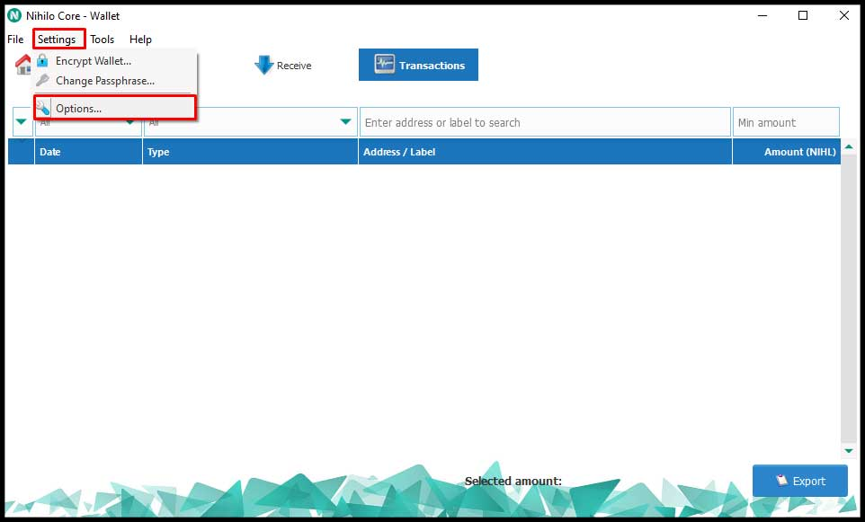
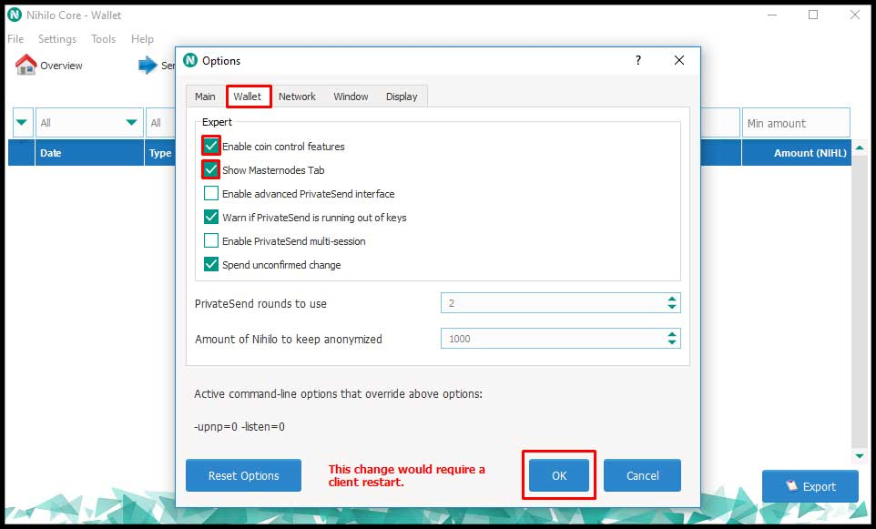
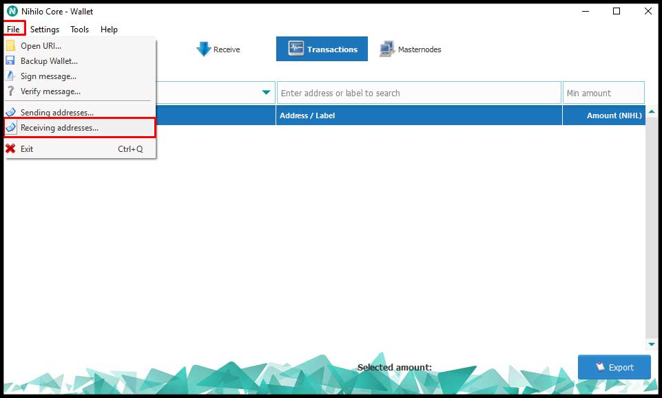
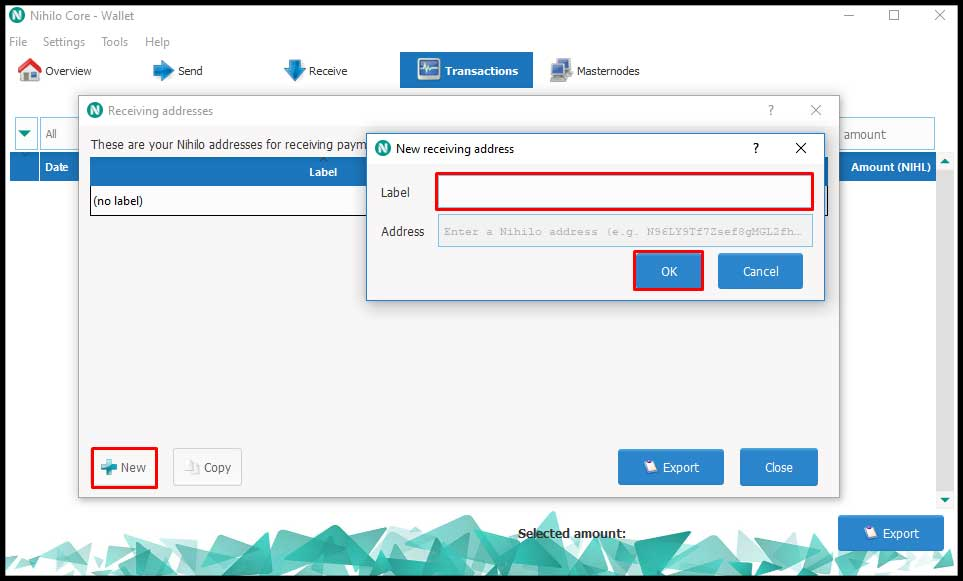
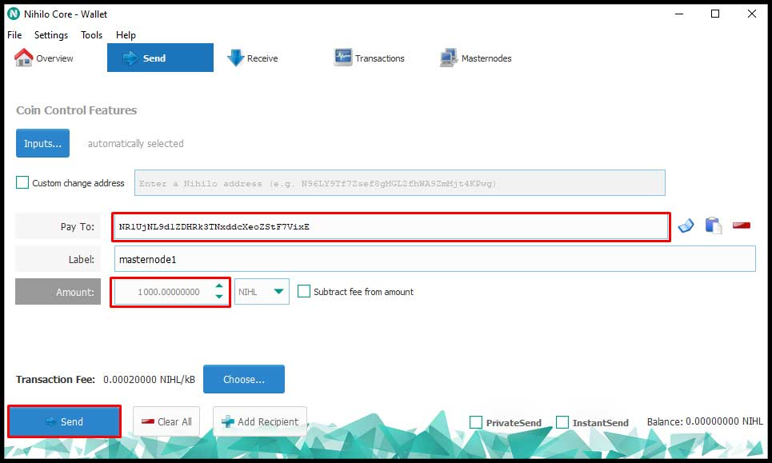
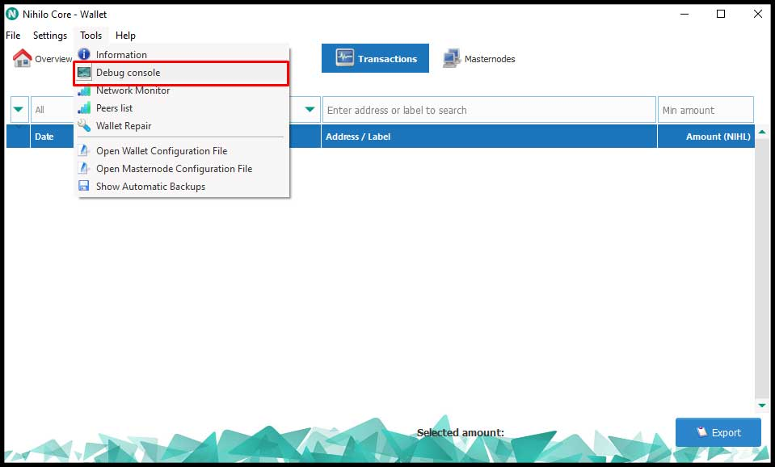
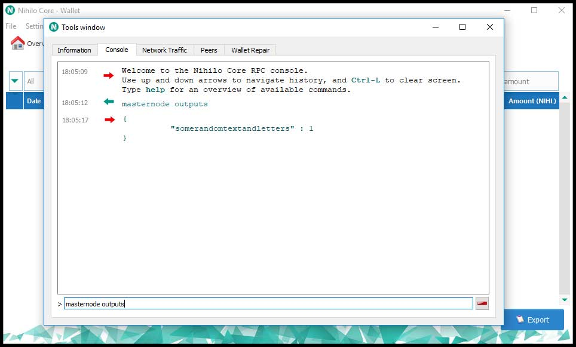
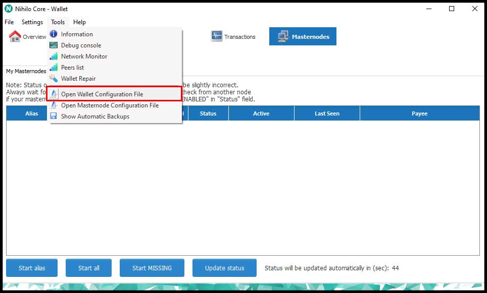

# [:arrow_backward:](../README.md) Masternode Guide for Windows Cold Wallet and Linux VPS
This guide will help you setup your **Nihilo Masternode** in the most convenient way. You keep a hot wallet on a **Linux VPS** so the **Masternode** can be always on and keep you collateral safe in your **Windows wallet** that isn't always connected to the internet.

Even is this guide is designed for **Windows Cold Wallet** it should also work for **Mac** and **Linux** QT wallets.

## Table of contents
- **[Requirements](#requirements)**
- **[Linux VPS Setup](#linux-vps-setup)**
	- **[Manual installation](#manual-installation)**
	- **[Easy install script](#easy-install-script) ( recommeded method )** 	
- **[Windows Setup](#windows-setup)**
	- **[Activate required options](#activate-required-options)**
	- **[Setting up the collateral address](#setting-up-the-collateral-address)**
	- **[Sending 1000 NIHL](#sending-1000-nihl)**
	- **[Configure Masternode](#configure-masternode)**
	- **[Start Masternode](#start-masternode)**

## Requirements
- 1000 **NIHL**
- **VPS Server** with **root** access runing **Ubuntu 16.04 x64** operation with the following **minimum** specs:
	- **1GHZ** CPU Core
	- **1GB** of ram
- **Windows** computer with a **ssh client** installed ( **[www.putty.org](http://www.putty.org)** is recommended )

## Linux VPS Setup
In order do proceed with this step you need to have acces to a **Linux VPS** running **Ubuntu 16.04** operating sistem. If you don't already have a **VPS** we recommend you get the **10$** one from **[www.vultr.com](https://www.vultr.com)**, one of the advantages of **Vultr** is that you can also pay with **BTC**.

We provide 2 methods of setting up the **Linux VPS** part of a **Nihilo Masternode**, a **[manual](./linux-masternode-manual-setup.md)** one where you need to install all the required dependecies and configure some files and an **[easy install script](#easy-install-script)** that does everything for you. We recommend you use the **[easy install script](#easy-install-script)**.

### Manual installation
We still think you should use the **easy install script** but if you are a **Linux guru** and want to do this the way you like it, then follow the instruction on **[how to manually setup the Linux VPS part of the masternode](./linux-masternode-manual-setup.md)**.

### Easy install script
Log intro your **VPS** using **[www.putty.org](http://www.putty.org)** or any other **ssh client** you have as **root** and type the following commands:

````js
cd
wget "https://raw.githubusercontent.com/nihilocoin/resources/master/scripts/mn-easy-install-v3.sh"
sudo chmod 755 mn-easy-install-v3.sh
bash mn-easy-install-v3.sh
````

Now grab a coffee :coffee: or whatever beverage you preffer and wait for the **easy install script** to do it's **magic**. 

The script can take up to an hour to finish doing it's magic so don't worry if you see a step taking longer than the other.

After the script finished it will output a line that you will need to **save** in order to setup the **Windows part of the masternode**. The output will look like this:

````
masternode1 [ip address]:[port] [private key] tx index 
````

:white_check_mark: **Congrats**, we are done with the **Linux VPS Setup** and we can move to the **Windows** part of the setup.

## Windows Setup
Now that we are done with the **Linux VPS** part we can finish the **masternode** setup on the **Windows Wallet**.

Let's start by opening the **Windows Wallet** and let it finish syncing. If you didn't download the wallet yet, you can do so by going to the **[releases on the main source repository](https://github.com/nihilocoin/nihilo/releases/tag/1.0.2)** and download the latest **Windows QT Wallet**.

### Activate required options
Go to the wallet's top menu and select **``Settings``** and then **``Options``**.



Now go to the **``Wallet``** tab, check **``Enable coin control features``** and **``Show masternodes Tab``**. Click **``Ok``** and restart wallet.




### Setting up the collateral address
Go to the wallet's top menu and select **``File``** and then **``Receiving addresses``**. 



In this window click on the **``New``** and set up an alias to the new address. It's up to you how you name it. Save the address and click **``OK``**. 



### Sending 1000 NIHL
Now go to the **``Send``** tab, input the **new address** that we created earlier in the **``Pay To``** field and **exactly** 1000 in the **``Amount``** field. Click on the **``Send``** button and wait for the transaction to have **at least 15 confirmations**. 



You can check the tranzactions by going to the **``Tranzactions``** tab, the first entry in the list should say **Payment to yourself** and the value should have a negative value.

### Configure Masternode
Remember the line that the **easy install script** gave us when it finished? We will be using it now.

But first we need to get the missing parameters from that line, **tx** and **index**. We do this by selecting **``Debug console``** from the wallet's top menu.



And typing in there **``masternode outputs``**. The output should look like this: 



The first random text is out **tx** and the second one is our **index**. Now replace **tx** and **index** with thoose value in the line you save from the **easy install script**.


Select from the wallet's top menu **``Open Masternode Configuration file``** NOT the wallet configuration highlighted in the image.



When it asks you what program to use, select Notepad and paste that line you saved on a new line in that text document. 

:exclamation:**Make sure that this is on a new line by itself and  there is only one space between the 5 values.**

:exclamation:**Also make sure that the file is saved usin ANSI character encoding.**

### Start Masternode
We are almost there. Go to the **``Masternodes``** tab and inside that to the **``My Masternodes``** tab, select your new masternode and click **``Start alias``** and it's status should change to **``Pre Enabled``**. If you see **``Watchdog Expired``** don't worry, it takes a little for **sentinel** to send the correct status.

:white_check_mark: **Awesome!** You now have your masternode started. If you encounter any problems we are happy to help on our **[Discord Channel](link-to-discord)**.

The **easy install script** also installs the **[Nihilo Utilities](./nihilo-utilities.md)** script that will help you with the common task of the **Linux Wallet**. Just type **``nihilo``** anywhere on the **VPS** to start it. You can learn more about it **[here](./nihilo-utilities.md)**.


 
